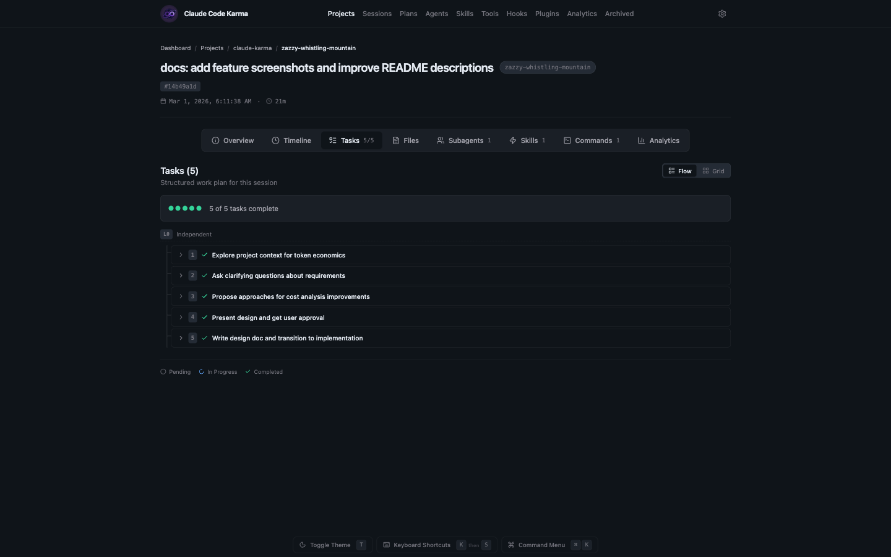
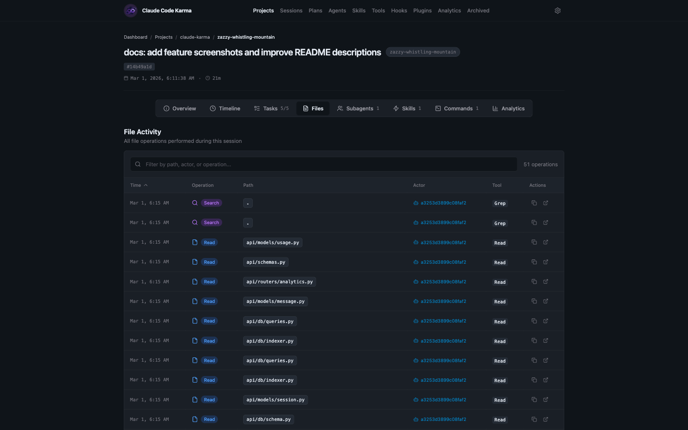
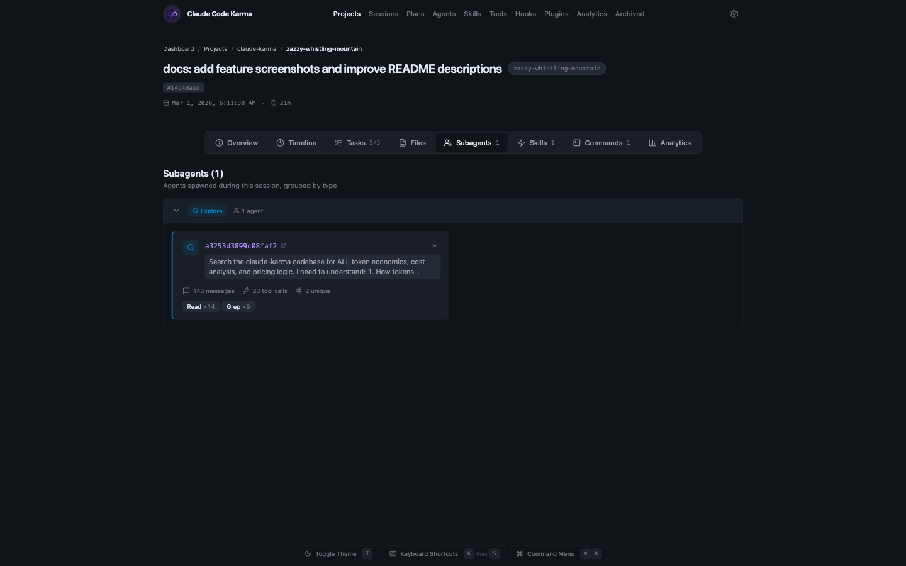
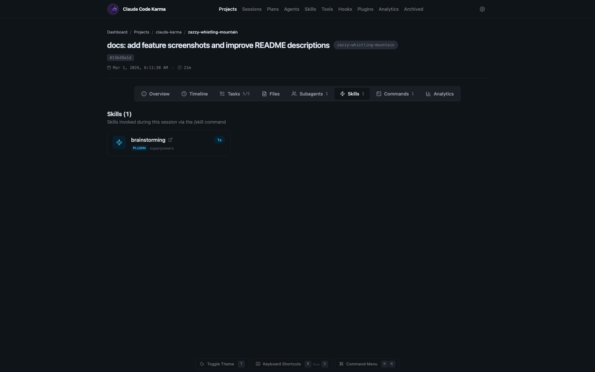
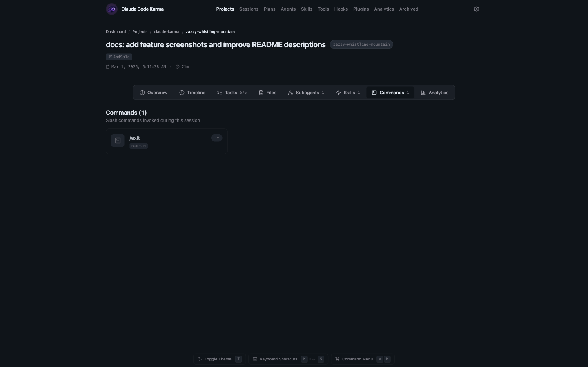
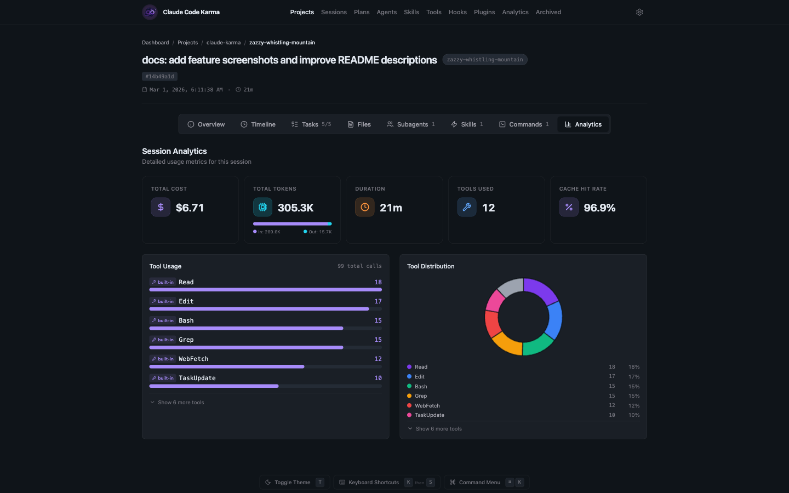
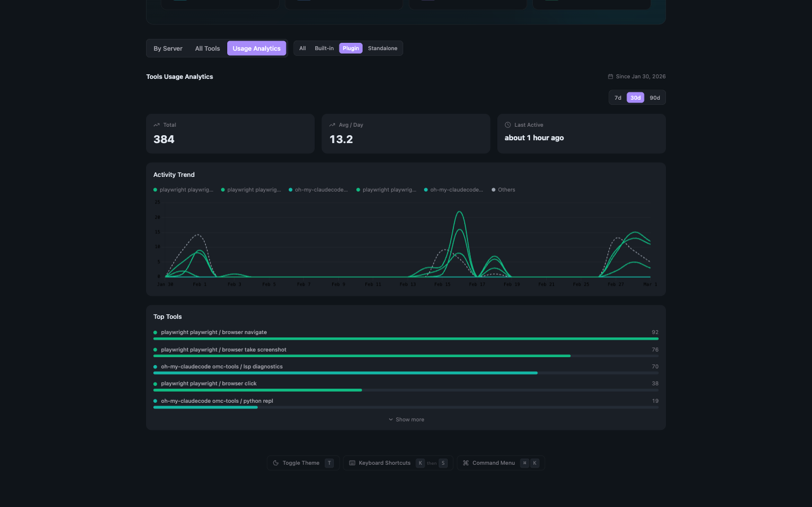

<p align="center">
  
</p>

<h1 align="center">Claude Code Karma</h1>

<p align="center">
  <strong>Your Claude Code sessions deserve more than a terminal.</strong><br />
  A local-first, open-source dashboard that turns your <code>~/.claude/</code> data into a visual story — sessions, timelines, costs, and live activity, all on your machine.
</p>

<p align="center">
  <a href="https://www.apache.org/licenses/LICENSE-2.0"></a>
  <a href="https://www.python.org/"></a>
  <a href="https://nodejs.org/"></a>
  <a href="https://kit.svelte.dev/"></a>
</p>

<br />

<p align="center">
  <a href="docs/screenshots/home.png" target="_blank">
    
  </a>
</p>

## Why Claude Code Karma?

If you use Claude Code, you already have a goldmine of data sitting in `~/.claude/` — every session, every tool call, every token. But it's all buried in JSONL files you'll never read.

> **Warning: Claude Code only keeps session data for about 30 days.** Older JSONL files in `~/.claude/projects/` are automatically cleaned up. Since Karma reads directly from those files, deleted sessions will disappear from the dashboard too.

Claude Code Karma reads that local data and gives you a proper dashboard. No cloud. No accounts. No telemetry. Just your data, on your machine.

## Features

### Session Browser

Browse all your Claude Code sessions in one place. Search by title, prompt, or slug. Filter by project. See live sessions at the top with real-time status badges.

<p align="center">
  
</p>

### Session Timeline & Overview

Dive into any session to see exactly what happened — every prompt, tool call, thinking block, and response laid out chronologically. The overview tab shows key stats like message count, duration, model used, and which tools were called.

<p align="center">
  
</p>

<p align="center">
  
</p>

### Session Detail Tabs

Each session page has dedicated tabs that break down different aspects of what happened during the session.

**Tasks** — See all tasks Claude created and completed during the session, displayed in a flow view with status tracking.

<p align="center">
  
</p>

**Files** — Every file operation in a sortable table — reads, writes, edits — with timestamps, actors, and the tools that made each change.

<p align="center">
  
</p>

**Subagents** — Agents spawned during the session, grouped by type. Expand each to see message counts, tool calls, and what they were asked to do.

<p align="center">
  
</p>

**Skills** — Skills invoked via `/skill` commands during the session, with their source plugin and invocation count.

<p align="center">
  
</p>

**Commands** — Slash commands used during the session, showing built-in and plugin commands with usage counts.

<p align="center">
  
</p>

**Analytics** — Per-session cost breakdown, token usage, cache hit rates, tool distribution with a donut chart, and a ranked list of every tool used.

<p align="center">
  
</p>

### Projects

See all your Claude Code workspaces organized by git repository. Each project card shows session count and when it was last active. Expand git repos to see individual project directories inside them.

<p align="center">
  
</p>

### Analytics

Track your token usage, costs, velocity trends, cache hit rates, and coding rhythm across all projects. See which models you use most and how your usage patterns change over time.

<p align="center">
  
</p>

### Tools

See every tool Claude Code uses — built-in ones like Read, Edit, and Bash, plus any MCP integrations you've added. Grouped by server with call counts and session coverage. Switch to the Usage Analytics tab for activity trends and top tools over time.

<p align="center">
  
</p>

<p align="center">
  
</p>

### Agents

Browse all your agents — built-in, custom, and plugin-provided. See total runs, token consumption, and filter by category to understand how your agent ecosystem is being used. The Usage Analytics view shows activity trends and your most-used agents.

<p align="center">
  
</p>

<p align="center">
  
</p>

### Hooks

Visualize all your Claude Code hooks organized by lifecycle phase — session start/end, tool use, agent lifecycle, and permissions. See which hooks can block execution and how many registrations each event has.

<p align="center">
  
</p>

### Plugins

View all installed Claude Code plugins with their agents, skills, and commands. Filter between official and community plugins. See version info and when each was last updated.

<p align="center">
  
</p>

### And More

- **Plans Browser** — View implementation plans and their execution status
- **Skills** — Track which skills are invoked and how often
- **Command Palette** — Quick navigation with `Ctrl+K` / `Cmd+K`
- **Full-text Search** — Search across session titles, prompts, and slugs
- **Live Sessions** — Real-time monitoring via Claude Code hooks

## Quick Start

```bash
# Clone the repository
git clone https://github.com/JayantDevkar/claude-code-karma.git
cd claude-code-karma

# Start API (Terminal 1)
cd api
pip install -e ".[dev]" && pip install -r requirements.txt
uvicorn main:app --reload --port 8000

# Start Frontend (Terminal 2)
cd frontend
npm install && npm run dev
```

Open **http://localhost:5173** to view the dashboard.

For detailed setup including live session tracking, see [SETUP.md](./SETUP.md).

## How It Works

Claude Code already saves everything locally — sessions, tool calls, token counts — as JSONL files in `~/.claude/`. Claude Code Karma simply reads those files and serves them through a local dashboard.

```
~/.claude/projects/  →  FastAPI (port 8000)  →  SvelteKit (port 5173)
   your data              parses & serves          visualizes it
```

Nothing leaves your machine. The API reads your local files, indexes metadata in a local SQLite database, and the frontend renders it all in the browser.

## Project Structure

```
claude-code-karma/
├── api/                    # FastAPI backend (Python) — port 8000
│   ├── models/             # Pydantic models for Claude Code data
│   ├── routers/            # API endpoints
│   └── services/           # Business logic
├── frontend/               # SvelteKit frontend (Svelte 5) — port 5173
│   ├── src/routes/         # Pages
│   └── src/lib/            # Components and utilities
├── captain-hook/           # Pydantic library for Claude Code hooks
└── hooks/                  # Hook scripts (symlinked to ~/.claude/hooks/)
    ├── live_session_tracker.py
    ├── session_title_generator.py
    └── plan_approval.py
```

## Live Session Tracking

Enable real-time session monitoring by installing Claude Code hooks. See [SETUP.md](./SETUP.md#live-sessions-tracking-optional) for setup instructions.

| State | Meaning |
|-------|---------|
| `LIVE` | Session actively running |
| `WAITING` | Waiting for user input |
| `STOPPED` | Agent finished, session open |
| `STALE` | User idle 60+ seconds |
| `ENDED` | Session terminated |

## Technology Stack

### Backend
- **Python 3.9+** with **FastAPI** and **Pydantic 2.x**
- **SQLite** for metadata indexing
- **pytest** for testing, **ruff** for linting

### Frontend
- **SvelteKit 2** with **Svelte 5** runes
- **Tailwind CSS 4** for styling
- **Chart.js 4** for visualizations
- **bits-ui** for accessible UI primitives
- **TypeScript** for type safety

### Libraries
- **captain-hook** — Type-safe Pydantic models for Claude Code's 10 hook types

## API Endpoints

<details>
<summary>View all endpoints</summary>

### Core

| Endpoint | Description |
|----------|-------------|
| `GET /projects` | List all projects |
| `GET /projects/{encoded_name}` | Project details with sessions |
| `GET /sessions/{uuid}` | Session details |
| `GET /sessions/{uuid}/timeline` | Session event timeline |
| `GET /sessions/{uuid}/tools` | Tool usage breakdown |
| `GET /sessions/{uuid}/file-activity` | File operations |
| `GET /sessions/{uuid}/subagents` | Subagent activity |

### Analytics

| Endpoint | Description |
|----------|-------------|
| `GET /analytics/projects/{encoded_name}` | Project analytics |
| `GET /analytics/dashboard` | Global dashboard metrics |

### Agents, Skills & Live Sessions

| Endpoint | Description |
|----------|-------------|
| `GET /agents` | List all agents |
| `GET /agents/{name}` | Agent details |
| `GET /skills` | List all skills |
| `GET /live-sessions` | Real-time session state |

</details>

## Contributing

Contributions are welcome! Please see [CONTRIBUTING.md](./CONTRIBUTING.md) for guidelines on:

- Reporting bugs
- Suggesting features
- Development setup
- Code style and testing
- Pull request process

## License

This project is licensed under the Apache License 2.0. See [LICENSE](./LICENSE) for details.

## Questions?

- See [SETUP.md](./SETUP.md) for installation and configuration help
- Check [CLAUDE.md](./CLAUDE.md) for development guidance
- Review existing [GitHub Issues](https://github.com/JayantDevkar/claude-code-karma/issues)

---

Built and maintained by [Jayant Devkar](https://github.com/JayantDevkar)
