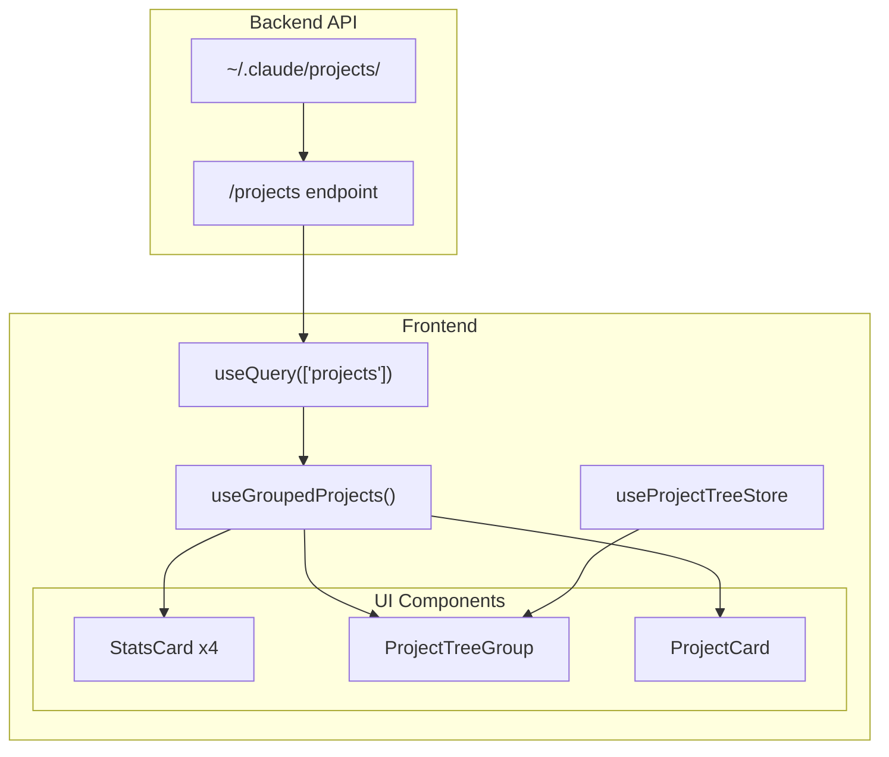

# Home View - Data Flow Logic

## Overview

The Home View (`/`) is the landing page that displays all Claude Code projects the user has worked on. It provides a high-level overview of activity across all projects, grouped intelligently by git repository structure.

**Route**: `/` (root)  
**Page Component**: [`apps/web/app/page.tsx`](../../apps/web/app/page.tsx)

---

## Data Sources

### API Endpoint

| Endpoint | Method | Response Type | Description |
|----------|--------|---------------|-------------|
| `/projects` | GET | `ProjectSummary[]` | Lists all projects with basic stats |

### Response Schema: `ProjectSummary`

```typescript
interface ProjectSummary {
  path: string;                      // Original filesystem path (e.g., "/Users/me/my-project")
  encoded_name: string;              // URL-safe encoded name (e.g., "-Users-me-my-project")
  session_count: number;             // Number of Claude Code sessions
  agent_count: number;               // Number of standalone agents
  exists: boolean;                   // Whether project directory still exists
  is_git_repository: boolean;        // True if project path has .git
  git_root_path: string | null;      // Git repo root (may differ from path for nested projects)
  is_nested_project: boolean;        // True if inside git repo but not at root
  latest_session_time: string | null; // ISO timestamp of most recent session
}
```

### Hooks Used

| Hook | Query Key | Source |
|------|-----------|--------|
| `useQuery(["projects"])` | `["projects"]` | `api.listProjects()` |
| `useGroupedProjects(projects)` | N/A (client-side) | Transforms ProjectSummary[] |

---

## Client-Side Data Transformation

### `useGroupedProjects` Hook

**Location**: [`apps/web/hooks/use-grouped-projects.ts`](../../apps/web/hooks/use-grouped-projects.ts)

This hook transforms the flat list of projects into a grouped structure for display:

```typescript
interface GroupedProjectsTree {
  gitRoots: GitRootGroup[];        // Multi-project git repos (2+ projects)
  singleGitProjects: ProjectSummary[]; // Single-project git repos
  otherProjects: ProjectSummary[]; // Non-git projects
  totalCount: number;
}

interface GitRootGroup {
  rootPath: string;                // Git repository root path
  displayName: string;             // Last segment of path for display
  rootProject: ProjectSummary | null; // Project at git root (if exists)
  nestedProjects: ProjectSummary[]; // Projects in subdirectories
  totalSessions: number;           // Sum of all sessions in group
  totalAgents: number;             // Sum of all agents in group
}
```

### Grouping Logic

1. **Separate** projects by `git_root_path`:
   - Projects with `git_root_path !== null` → git projects
   - Projects with `git_root_path === null` → non-git projects

2. **Group git projects** by their `git_root_path`:
   - If 2+ projects share same git root → `GitRootGroup` (collapsible)
   - If 1 project in git root → `singleGitProjects` (flat card)

3. **Sort all groups** by `latest_session_time` (most recent first)

---

## Visual Logic

### Page Layout

```
┌─────────────────────────────────────────────────────────────────┐
│  Projects                                                        │
│  Monitor your Claude Code activity across all projects          │
├─────────────────────────────────────────────────────────────────┤
│  ┌──────────┐ ┌──────────┐ ┌──────────┐ ┌──────────┐           │
│  │ Git Repos│ │Non-Git   │ │ Total    │ │ Total    │           │
│  │    12    │ │    3     │ │ Sessions │ │ Agents   │           │
│  │          │ │          │ │   156    │ │    8     │           │
│  └──────────┘ └──────────┘ └──────────┘ └──────────┘           │
├─────────────────────────────────────────────────────────────────┤
│  Git Repositories (12)                    [Expand] [Collapse]   │
│  ┌─────────────────────────────────────────────────────────────┐│
│  │ ▼ my-monorepo                              3 projects       ││
│  │   ├─ [Root] my-monorepo         5 sessions                 ││
│  │   ├─ packages/web               12 sessions                 ││
│  │   └─ packages/api               8 sessions                  ││
│  └─────────────────────────────────────────────────────────────┘│
│  ┌──────────┐ ┌──────────┐ ┌──────────┐                        │
│  │ project-a│ │ project-b│ │ project-c│  (single git projects) │
│  └──────────┘ └──────────┘ └──────────┘                        │
├─────────────────────────────────────────────────────────────────┤
│  Non-Git Projects (3)                                           │
│  ┌──────────┐ ┌──────────┐ ┌──────────┐                        │
│  │ scratch  │ │ temp-proj│ │ notes    │                        │
│  └──────────┘ └──────────┘ └──────────┘                        │
└─────────────────────────────────────────────────────────────────┘
```

### Stats Overview Section

**Component**: [`StatsCard`](../../apps/web/components/stats-card.tsx)

| Stat | Value Source | Icon |
|------|--------------|------|
| Git Repositories | `gitRoots.length + singleGitProjects.length` | `FolderGit2Icon` |
| Non-Git Projects | `otherProjects.length` | `FolderIcon` |
| Total Sessions | `sum(project.session_count)` | `LayersIcon` |
| Total Agents | `sum(project.agent_count)` | (default) |

### Git Repositories Section

#### Multi-Project Repos (Collapsible)

**Components**:
- [`CollapsibleGroupContainer`](../../apps/web/components/collapsible-group.tsx) - Radix accordion wrapper
- [`ProjectTreeGroup`](../../apps/web/components/project-tree-group.tsx) - Renders a GitRootGroup

**State Management**: `useProjectTreeStore` (Zustand) persists expand/collapse state

**Visual Features**:
- Chevron icon for expand/collapse
- Badge showing total project count
- Root project marked with "Root" badge
- Nested projects shown with relative path
- Nested git repos (submodules) get "Git" badge

#### Single-Project Repos (Cards)

**Component**: [`ProjectCard`](../../apps/web/components/project-card.tsx)

Grid layout: `sm:grid-cols-2 lg:grid-cols-3`

### Non-Git Projects Section

Same `ProjectCard` component as single git projects, displayed in grid layout.

### ProjectCard Visual Elements

| Element | Data Source | Condition |
|---------|-------------|-----------|
| Icon | `GitBranchIcon` or `FolderIcon` | Based on `git_root_path` |
| Project Name | Last segment of `path` | Always shown |
| Full Path | `path` (or `relativePath` for nested) | Truncated |
| Session Count | `session_count` | Always shown |
| Agent Count | `agent_count` | Only if > 0 |
| "Git" Badge | - | If `is_git_repository` |
| "Missing" Badge | - | If `!exists` |
| "Root" Badge | - | If showing as root in group |

---

## Loading & Error States

### Loading State

Skeleton placeholders:
- 4 animated card skeletons with `h-[72px]` height

### Error State

Centered error card with:
- "Failed to load projects" title
- Hint to check API server at localhost:8000
- "Retry" button that calls `refetch()`

### Empty State

Centered dashed-border container with:
- `FolderIcon` placeholder
- "No projects found" message
- Hint about `~/.claude/projects/` location

---

## Data Flow Diagram



---

## Caching & Revalidation

| Setting | Value |
|---------|-------|
| Stale Time | 5 minutes |
| Cache Key | `["projects"]` |
| Refetch on Window Focus | Yes (TanStack Query default) |
