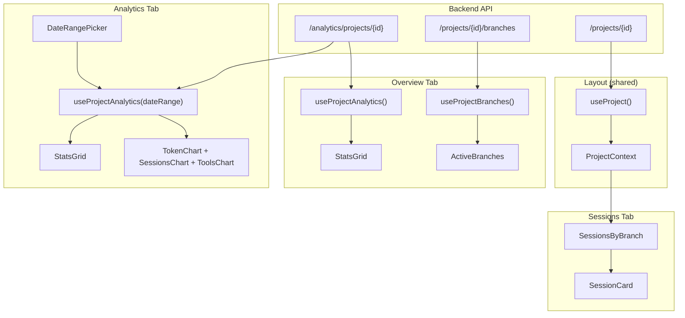

# Project View - Data Flow Logic

## Overview

The Project View displays detailed information about a single Claude Code project, including its sessions, analytics, and branch activity. It uses a tabbed interface with three tabs: Overview, Sessions, and Analytics.

**Route**: `/project/[encodedName]`  
**Layout Component**: [`apps/web/app/project/[encodedName]/layout.tsx`](../../apps/web/app/project/[encodedName]/layout.tsx)

---

## Layout Data (Shared Across Tabs)

### API Endpoint

| Endpoint | Method | Response Type | Description |
|----------|--------|---------------|-------------|
| `/projects/{encoded_name}` | GET | `ProjectDetail` | Project details with sessions list |

### Response Schema: `ProjectDetail`

```typescript
interface ProjectDetail extends ProjectSummary {
  sessions: SessionSummary[];  // All sessions for this project
}

interface SessionSummary {
  uuid: string;                    // Session unique identifier
  slug: string | null;             // Human-readable name (e.g., "eager-puzzling-fairy")
  project_encoded_name: string | null;
  message_count: number;
  start_time: string | null;       // ISO timestamp
  end_time: string | null;
  duration_seconds: number | null;
  models_used: string[];           // e.g., ["claude-3-5-sonnet-20241022"]
  subagent_count: number;
  has_todos: boolean;
  todo_count: number;
  initial_prompt: string | null;   // First 500 chars of first user message
  git_branches: string[];          // Branches touched during session
}
```

### Hooks Used

| Hook | Query Key | Source |
|------|-----------|--------|
| `useProject(encodedName)` | `["project", encodedName]` | `api.getProject()` |

### Context Provider

**Component**: [`ProjectProvider`](../../apps/web/app/project/[encodedName]/project-context.tsx)

Provides `project` and `encodedName` to all child tabs via React Context.

---

## Layout Visual Structure

```
┌─────────────────────────────────────────────────────────────────┐
│  ← Back to projects                                              │
│                                                                  │
│  my-project-name                                                 │
│  /Users/me/Documents/my-project                                  │
├─────────────────────────────────────────────────────────────────┤
│  [Overview]  [Sessions]  [Analytics]                             │
│  ─────────                                                       │
├─────────────────────────────────────────────────────────────────┤
│                                                                  │
│                    {Tab Content Here}                            │
│                                                                  │
└─────────────────────────────────────────────────────────────────┘
```

### Tab Navigation

| Tab | Route | Icon | Component |
|-----|-------|------|-----------|
| Overview | `/project/{id}` | `LayoutDashboardIcon` | `page.tsx` |
| Sessions | `/project/{id}/sessions` | `LayersIcon` | `sessions/page.tsx` |
| Analytics | `/project/{id}/analytics` | `BarChart3Icon` | `analytics/page.tsx` |

---

## Tab 1: Overview

**Page Component**: [`apps/web/app/project/[encodedName]/page.tsx`](../../apps/web/app/project/[encodedName]/page.tsx)

### Data Sources

| Endpoint | Method | Response Type | Description |
|----------|--------|---------------|-------------|
| `/analytics/projects/{encoded_name}` | GET | `ProjectAnalytics` | Aggregated project metrics |
| `/projects/{encoded_name}/branches` | GET | `ProjectBranchesResponse` | Branch activity data |

### Response Schema: `ProjectAnalytics`

```typescript
interface ProjectAnalytics {
  total_sessions: number;
  total_tokens: number;
  total_input_tokens: number;
  total_output_tokens: number;
  total_duration_seconds: number;
  estimated_cost_usd: number;
  models_used: Record<string, number>;  // model_name -> usage count
  cache_hit_rate: number;               // 0.0 to 1.0
  tools_used: Record<string, number>;   // tool_name -> usage count
  sessions_by_date: Record<string, number>; // YYYY-MM-DD -> session count
}
```

### Response Schema: `ProjectBranchesResponse`

```typescript
interface ProjectBranchesResponse {
  branches: BranchSummary[];
  active_branches: string[];           // Branches used in most recent session
  sessions_by_branch: Record<string, string[]>; // branch -> session UUIDs
}

interface BranchSummary {
  name: string;
  session_count: number;
  last_active: string | null;          // ISO timestamp
  is_active: boolean;                  // Used in most recent session
}
```

### Hooks Used

| Hook | Query Key | Source |
|------|-----------|--------|
| `useProjectAnalytics(encodedName)` | `["project-analytics", encodedName]` | `api.getProjectAnalytics()` |
| `useProjectBranches(encodedName)` | `["project-branches", encodedName]` | `api.getProjectBranches()` |

### Visual Layout

```
┌─────────────────────────────────────────────────────────────────┐
│  ┌──────────┐ ┌──────────┐ ┌──────────┐ ┌──────────┐ ┌────────┐│
│  │ Sessions │ │  Tokens  │ │ Duration │ │   Cost   │ │ Cache  ││
│  │    42    │ │  1.2M    │ │  5h 23m  │ │  $12.45  │ │ 67.5%  ││
│  │          │ │ 800K/400K│ │          │ │          │ │hit rate││
│  └──────────┘ └──────────┘ └──────────┘ └──────────┘ └────────┘│
├─────────────────────────────────────────────────────────────────┤
│  Active Branches (last 24h)                                      │
│  ┌─────────────┐ ┌─────────────┐ ┌─────────────┐                │
│  │ 🌿 main     │ │ 🌿 feature-x│ │ 🌿 fix-bug  │                │
│  │ (5 sessions)│ │ (3 sessions)│ │ (1 session) │                │
│  └─────────────┘ └─────────────┘ └─────────────┘                │
└─────────────────────────────────────────────────────────────────┘
```

### Stats Grid

**Component**: [`StatsGrid`](../../apps/web/components/stats-grid.tsx)

| Stat | Value | Description | Icon |
|------|-------|-------------|------|
| Sessions | `total_sessions` | Total count | `LayersIcon` |
| Total Tokens | `total_tokens` | Formatted (e.g., "1.2M") | `CpuIcon` |
| Total Duration | `total_duration_seconds` | Formatted (e.g., "5h 23m") | `ClockIcon` |
| Estimated Cost | `estimated_cost_usd` | USD format (e.g., "$12.45") | `DollarSignIcon` |
| Cache Hit Rate | `cache_hit_rate * 100` | Percentage | `PercentIcon` |

### Active Branches Section

**Component**: [`ActiveBranches`](../../apps/web/components/active-branches.tsx)

**Condition**: Only shown if `project.git_root_path !== null` AND `branchData.active_branches.length > 0`

Displays pill badges for each active branch with session count.

---

## Tab 2: Sessions

**Page Component**: [`apps/web/app/project/[encodedName]/sessions/page.tsx`](../../apps/web/app/project/[encodedName]/sessions/page.tsx)

### Data Source

Uses `project.sessions` from the ProjectContext (no additional API call).

### Visual Layout

```
┌─────────────────────────────────────────────────────────────────┐
│  Sessions (42)                                                   │
│  All Claude Code sessions for this project                       │
├─────────────────────────────────────────────────────────────────┤
│  [By Branch] [All]                          [Expand] [Collapse] │
├─────────────────────────────────────────────────────────────────┤
│  ▼ main (15 sessions)                                            │
│    ┌──────────────┐ ┌──────────────┐ ┌──────────────┐           │
│    │session-slug-1│ │session-slug-2│ │session-slug-3│           │
│    │3.5 Sonnet    │ │3.5 Sonnet    │ │4 Opus        │           │
│    │"Add login..."│ │"Fix the bug" │ │"Refactor..." │           │
│    │12 msgs · 5m  │ │8 msgs · 3m   │ │45 msgs · 2h  │           │
│    └──────────────┘ └──────────────┘ └──────────────┘           │
├─────────────────────────────────────────────────────────────────┤
│  ▼ feature-auth (8 sessions)                                     │
│    ...                                                           │
├─────────────────────────────────────────────────────────────────┤
│  ▶ No Branch (2 sessions)                                        │
└─────────────────────────────────────────────────────────────────┘
```

### Main Component

**Component**: [`SessionsByBranch`](../../apps/web/components/sessions-by-branch.tsx)

### View Modes

| Mode | Condition | Display |
|------|-----------|---------|
| "By Branch" | Git project (default) | Sessions grouped by `git_branches` |
| "All" | Any project | Flat grid of all sessions |

**Non-git projects**: Only show "All" view (no toggle)

### Branch Grouping Logic

```typescript
function groupSessionsByBranch(sessions: SessionSummary[]): GroupedSessions {
  // Sessions with multiple branches appear in ALL relevant groups
  // Sessions with no branches go into "No Branch" group
  // Sessions sorted by start_time (most recent first) within each group
}
```

**Sorting**:
- Branches sorted by most recent session time
- "No Branch" always appears last

### Session Card

**Component**: [`SessionCard`](../../apps/web/components/session-card.tsx)

| Element | Data Source | Format |
|---------|-------------|--------|
| Session Name | `slug` or `uuid.slice(0,8)` | Text (slug is styled, UUID is mono) |
| Model Badge | `models_used[0]` | "3.5 Sonnet (20241022)" format |
| Initial Prompt | `initial_prompt` | Truncated to 150 chars, 2 lines max |
| Message Count | `message_count` | "12 msgs" |
| Duration | `duration_seconds` | "5m" or "2h 15m" |
| Subagent Count | `subagent_count` | Only if > 0, "3 subagents" |
| Todos Badge | `has_todos` | Green "Todos" badge |
| Relative Time | `start_time` | "2 hours ago" |

---

## Tab 3: Analytics

**Page Component**: [`apps/web/app/project/[encodedName]/analytics/page.tsx`](../../apps/web/app/project/[encodedName]/analytics/page.tsx)

### Data Source

| Endpoint | Method | Query Params | Response Type |
|----------|--------|--------------|---------------|
| `/analytics/projects/{encoded_name}` | GET | `start_date`, `end_date` | `ProjectAnalytics` |

### Hooks Used

| Hook | Query Key | Source |
|------|-----------|--------|
| `useProjectAnalytics(encodedName, dateRange)` | `["project-analytics", encodedName, startDate, endDate]` | `api.getProjectAnalytics()` |
| `useDateRange()` | N/A (local state) | Date range picker state |

### Visual Layout

```
┌─────────────────────────────────────────────────────────────────┐
│  Analytics                                   ┌─────────────────┐│
│  Token usage, session trends...              │ Jan 1 - Jan 31  ││
│                                              └─────────────────┘│
├─────────────────────────────────────────────────────────────────┤
│  ┌──────────┐ ┌──────────┐ ┌──────────┐ ┌──────────┐           │
│  │ Sessions │ │  Tokens  │ │ Duration │ │   Cost   │           │
│  │(Filtered)│ │(Filtered)│ │(Filtered)│ │(Filtered)│           │
│  │    12    │ │  450K    │ │  2h 10m  │ │  $5.23   │           │
│  └──────────┘ └──────────┘ └──────────┘ └──────────┘           │
├─────────────────────────────────────────────────────────────────┤
│  ┌─────────────────┐ ┌─────────────────┐ ┌─────────────────┐   │
│  │   Token Usage   │ │ Sessions/Date   │ │   Tool Usage    │   │
│  │   ┌───────┐     │ │      ▄          │ │ Read      ████  │   │
│  │   │ Input │     │ │    ▄ █ ▄        │ │ Write     ███   │   │
│  │   │  67%  │     │ │  ▄ █ █ █ ▄      │ │ Shell     ██    │   │
│  │   └───────┘     │ │  █ █ █ █ █      │ │ Grep      █     │   │
│  │   Output: 33%   │ │ Jan 1 ... Jan 31│ │                 │   │
│  └─────────────────┘ └─────────────────┘ └─────────────────┘   │
└─────────────────────────────────────────────────────────────────┘
```

### Date Range Picker

**Component**: [`DateRangePicker`](../../apps/web/components/date-range-picker.tsx)

**State Hook**: `useDateRange()` returns:
- `dateRange: { startDate?: string, endDate?: string }`
- `setDateRange: (range) => void`
- `hasFilter: boolean`

When filter is active, stat labels change to "(Filtered)".

### Stats Grid

**Component**: [`StatsGrid`](../../apps/web/components/stats-grid.tsx)

Same stats as Overview tab, but labels indicate "(Filtered)" when date range active.

### Charts

**Components**: [`TokenChart`, `SessionsChart`, `ToolsChart`](../../apps/web/components/token-chart.tsx)

| Chart | Data Source | Type |
|-------|-------------|------|
| Token Usage | `total_input_tokens`, `total_output_tokens` | Pie/Donut chart |
| Sessions by Date | `sessions_by_date` | Bar chart |
| Tool Usage | `tools_used` | Horizontal bar chart |

Grid layout: `lg:grid-cols-3`

---

## Data Flow Diagram



---

## Caching & Revalidation

| Query | Stale Time | Cache Key |
|-------|------------|-----------|
| Project Detail | 2 minutes | `["project", encodedName]` |
| Project Analytics | 2 minutes | `["project-analytics", encodedName, startDate, endDate]` |
| Project Branches | 5 minutes | `["project-branches", encodedName]` |

---

## Loading & Error States

### Layout Loading

Skeleton placeholders for:
- Title area (h-8, w-48)
- Path area (h-6, w-96)
- Tab navigation placeholder
- Content area (h-[400px])

### Layout Error

`EmptyState` component with:
- `AlertCircleIcon`
- Error message from API
- "Back to projects" link

### Tab Loading

Each tab has its own skeleton:
- Overview: `StatsGridSkeleton` with 5 items
- Sessions: Card skeletons
- Analytics: `AnalyticsPageSkeleton` with stats + chart placeholders
