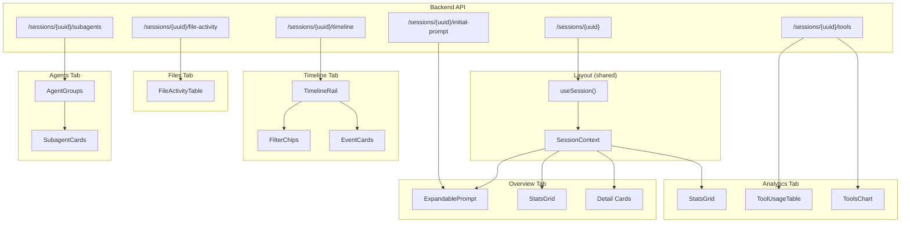

# Session View - Data Flow Logic

## Overview

The Session View displays detailed information about a single Claude Code session, including its conversation timeline, file operations, spawned subagents, and usage analytics. It uses a tabbed interface with five tabs: Overview, Timeline, Files, Agents, and Analytics.

**Route**: `/session/[uuid]`  
**Layout Component**: [`apps/web/app/session/[uuid]/layout.tsx`](../../apps/web/app/session/[uuid]/layout.tsx)

---

## Layout Data (Shared Across Tabs)

### API Endpoint

| Endpoint | Method | Response Type | Description |
|----------|--------|---------------|-------------|
| `/sessions/{uuid}` | GET | `SessionDetail` | Full session details |

### Response Schema: `SessionDetail`

```typescript
interface SessionDetail {
  uuid: string;
  slug: string | null;                 // Human-readable name (e.g., "eager-puzzling-fairy")
  project_encoded_name: string | null; // For "Back to project" link
  message_count: number;
  start_time: string | null;           // ISO timestamp
  end_time: string | null;
  duration_seconds: number | null;
  models_used: string[];
  subagent_count: number;
  has_todos: boolean;
  todo_count: number;
  initial_prompt: string | null;       // First 500 chars
  tools_used: Record<string, number>;  // tool_name -> count
  git_branches: string[];
  working_directories: string[];
  total_input_tokens: number;
  total_output_tokens: number;
  cache_hit_rate: number;              // 0.0 to 1.0
  total_cost: number;                  // USD
  todos: TodoItem[];                   // Current todo state
}

interface TodoItem {
  content: string;
  status: "pending" | "in_progress" | "completed";
  activeForm: string | null;           // Active verb form for display
}
```

### Hooks Used

| Hook | Query Key | Source |
|------|-----------|--------|
| `useSession(uuid)` | `["session", uuid]` | `api.getSession()` |

### Context Provider

**Component**: [`SessionProvider`](../../apps/web/app/session/[uuid]/session-context.tsx)

Provides `session` and `uuid` to all child tabs via React Context.

---

## Layout Visual Structure

```
┌─────────────────────────────────────────────────────────────────┐
│  ← Back to project                                               │
│                                                                  │
│  eager-puzzling-fairy                    1.2M tokens · 2h 15m   │
│  a1b2c3d4-e5f6-7890-abcd-ef1234567890   · 5 subagents           │
├─────────────────────────────────────────────────────────────────┤
│  [Overview]  [Timeline]  [Files]  [Agents]  [Analytics]         │
│  ──────────                                                      │
├─────────────────────────────────────────────────────────────────┤
│                                                                  │
│                    {Tab Content Here}                            │
│                                                                  │
└─────────────────────────────────────────────────────────────────┘
```

### Header Stats

| Element | Data Source | Format |
|---------|-------------|--------|
| Session Name | `slug` or "Session" | Title |
| UUID | `uuid` | Monospace, muted |
| Total Tokens | `total_input_tokens + total_output_tokens` | Formatted (e.g., "1.2M") |
| Duration | `duration_seconds` | Formatted (e.g., "2h 15m") |
| Subagent Count | `subagent_count` | "5 subagents" |

### Tab Navigation

| Tab | Route | Icon | Component |
|-----|-------|------|-----------|
| Overview | `/session/{uuid}` | `InfoIcon` | `page.tsx` |
| Timeline | `/session/{uuid}/timeline` | `ClockIcon` | `timeline/page.tsx` |
| Files | `/session/{uuid}/files` | `FileIcon` | `files/page.tsx` |
| Agents | `/session/{uuid}/agents` | `BotIcon` | `agents/page.tsx` |
| Analytics | `/session/{uuid}/analytics` | `BarChart3Icon` | `analytics/page.tsx` |

---

## Tab 1: Overview

**Page Component**: [`apps/web/app/session/[uuid]/page.tsx`](../../apps/web/app/session/[uuid]/page.tsx)

### Data Source

Uses `session` from SessionContext (no additional API call).

Optional lazy fetch for full prompt:
| Endpoint | Method | Response Type | Description |
|----------|--------|---------------|-------------|
| `/sessions/{uuid}/initial-prompt` | GET | `InitialPrompt` | Full first user message |

```typescript
interface InitialPrompt {
  content: string;      // Full message content
  timestamp: string;    // ISO timestamp
}
```

### Visual Layout

```
┌─────────────────────────────────────────────────────────────────┐
│  Initial Prompt                                          [Show] │
│  ┌─────────────────────────────────────────────────────────────┐│
│  │ "Please help me implement a user authentication system..." ││
│  │ (truncated preview, click Show for full)                    ││
│  └─────────────────────────────────────────────────────────────┘│
├─────────────────────────────────────────────────────────────────┤
│  ┌──────────────────────────┐ ┌──────────────────────────────┐ │
│  │ Messages                 │ │ Duration                     │ │
│  │ 45                       │ │ 2h 15m                       │ │
│  │                          │ │ Last activity: Jan 15, 2:30pm│ │
│  └──────────────────────────┘ └──────────────────────────────┘ │
├─────────────────────────────────────────────────────────────────┤
│  ┌──────────────────┐ ┌──────────────────┐ ┌──────────────────┐│
│  │ Models Used      │ │ Git Branches     │ │ Working Dirs     ││
│  │ ┌──────────────┐ │ │ ┌──────────────┐ │ │ /Users/me/proj   ││
│  │ │3.5 Sonnet    │ │ │ │ main         │ │ │ /Users/me/proj/  ││
│  │ │(20241022)    │ │ │ │ feature-x    │ │ │   subdir         ││
│  │ └──────────────┘ │ │ └──────────────┘ │ │ +2 more          ││
│  └──────────────────┘ └──────────────────┘ └──────────────────┘│
├─────────────────────────────────────────────────────────────────┤
│  Tools Used (127 calls)                                         │
│  ┌────────────────────────────────────────────────────────────┐ │
│  │ Read ×45  Write ×23  Shell ×18  Grep ×15  StrReplace ×12   │ │
│  │ LS ×8  Glob ×4  Task ×2                                     │ │
│  └────────────────────────────────────────────────────────────┘ │
└─────────────────────────────────────────────────────────────────┘
```

### Components

| Component | Purpose |
|-----------|---------|
| [`ExpandablePrompt`](../../apps/web/components/expandable-prompt.tsx) | Shows truncated prompt with "Show more" |
| [`StatsGrid`](../../apps/web/components/stats-grid.tsx) | Messages and Duration stats |

### Stats

| Stat | Value | Icon | Description |
|------|-------|------|-------------|
| Messages | `message_count` | `MessageSquareIcon` | Total messages |
| Duration | `duration_seconds` | `ClockIcon` | With last activity timestamp |

### Detail Cards

| Card | Data Source | Condition |
|------|-------------|-----------|
| Models Used | `models_used` | Always (if not empty) |
| Git Branches | `git_branches` | If any branches |
| Working Directories | `working_directories` | If any dirs (max 5 shown) |

### Tools Summary

**Data**: `tools_used` object converted to sorted array by count

Display: Horizontal flex wrap of pill badges with tool name and count.

---

## Tab 2: Timeline

**Page Component**: [`apps/web/app/session/[uuid]/timeline/page.tsx`](../../apps/web/app/session/[uuid]/timeline/page.tsx)

### Data Source

| Endpoint | Method | Response Type | Description |
|----------|--------|---------------|-------------|
| `/sessions/{uuid}/timeline` | GET | `TimelineEvent[]` | Chronological events |

### Response Schema: `TimelineEvent`

```typescript
interface TimelineEvent {
  id: string;                          // Unique event ID
  event_type: TimelineEventType;
  timestamp: string;                   // ISO timestamp
  actor: string;                       // "user", "session", or subagent ID
  actor_type: "user" | "session" | "subagent";
  title: string;                       // Short summary
  summary: string | null;              // Preview text
  metadata: Record<string, any>;       // Tool-specific data
}

type TimelineEventType =
  | "prompt"           // User message
  | "tool_call"        // Tool invocation (with merged result)
  | "subagent_spawn"   // Task tool creating subagent
  | "thinking"         // Claude thinking block
  | "response"         // Claude text response
  | "todo_update";     // TodoWrite tool
```

### Visual Layout

```
┌─────────────────────────────────────────────────────────────────┐
│  Timeline                                                        │
│  Chronological sequence of events in this session               │
├─────────────────────────────────────────────────────────────────┤
│  ┌─────────────────────────────────────────────────────────────┐│
│  │ 💬 15 user prompts │ 🔧 89 tool calls │ 🤖 5 subagents      ││
│  │ ☑️ 3 todo updates  │                   Showing 112 events   ││
│  └─────────────────────────────────────────────────────────────┘│
├─────────────────────────────────────────────────────────────────┤
│  ●─── +0:00 ──────────────────────────────────────────────────  │
│  │  ┌─────────────────────────────────────────────────────────┐ │
│  │  │ 💬 User prompt                                 10:30 AM │ │
│  │  │ "Please implement authentication for the app..."       │ │
│  │  └─────────────────────────────────────────────────────────┘ │
│  │                                                              │
│  ●─── +0:05 ──────────────────────────────────────────────────  │
│  │  ┌─────────────────────────────────────────────────────────┐ │
│  │  │ 📁 Read file                  [Read] [✓ done]  +5s     │ │
│  │  │ src/auth/login.ts                                       │ │
│  │  │ ▶ Click to expand input/output                          │ │
│  │  └─────────────────────────────────────────────────────────┘ │
│  │                                                              │
│  ●─── +1:30 ──────────────────────────────────────────────────  │
│  │  ┌─────────────────────────────────────────────────────────┐ │
│  │  │ 🤖 Spawn subagent [Explore]   → a1b2c3d        +1m 30s │ │
│  │  │ "Explore the codebase to find auth patterns..."        │ │
│  │  └─────────────────────────────────────────────────────────┘ │
│  ⋮                                                              │
└─────────────────────────────────────────────────────────────────┘
```

### Main Component

**Component**: [`TimelineRail`](../../apps/web/components/timeline-rail.tsx)

### Filter Bar (Stats/Chips)

Clickable filter chips for multi-select filtering:

| Filter | Matches | Color |
|--------|---------|-------|
| User Prompts | `event_type === "prompt"` | Blue |
| Tool Calls | `event_type === "tool_call"` | Emerald |
| Subagents Spawned | `metadata.spawned_agent_id` exists | Purple |
| Todo Updates | `event_type === "todo_update"` | Violet |

**Behavior**:
- Click chip to toggle filter on/off
- Multiple filters = OR logic (show events matching ANY)
- Non-matching events are dimmed (opacity: 40%)
- "Clear" button resets all filters

### Event Card Structure

| Element | Source | Display |
|---------|--------|---------|
| Icon | `event_type` + tool name | Color-coded circle |
| Title | `title` | Bold text |
| Actor Badge | `actor_type === "subagent"` | Purple pill with agent ID |
| Tool Badge | `metadata.tool_name` | Monospace badge |
| Result Status | `metadata.result_status` | Green/red badge |
| Timestamp | `timestamp` | Elapsed time (hover for absolute) |
| Summary | `summary` | Truncated, expandable |

### Event Type Icons

| Event Type | Icon | Color |
|------------|------|-------|
| `prompt` | `MessageSquareIcon` | Blue |
| `tool_call` | Tool-specific icon | Emerald |
| `subagent_spawn` | `BotIcon` | Purple |
| `thinking` | `BrainIcon` | Amber |
| `response` | `MessageCircleIcon` | Slate |
| `todo_update` | `ListTodoIcon` | Violet |

### Tool-Specific Icons

| Tool | Icon |
|------|------|
| Read | `FileIcon` |
| Write | `FilePlusIcon` |
| StrReplace | `FilePenIcon` |
| Delete | `FileMinusIcon` |
| Shell | `TerminalIcon` |
| Glob, Grep, SemanticSearch | `SearchIcon` |
| LS | `FolderIcon` |
| Task, TaskOutput | `BotIcon` |
| TodoWrite | `ListTodoIcon` |
| WebSearch | `GlobeIcon` |
| Others | `SparklesIcon` |

### Expandable Content

Clicking an event card expands to show:
- **Tool calls**: Input parameters + result content
- **Prompts**: Full message text
- **Thinking**: Full thinking block
- **Todo updates**: Full list of todos with status

---

## Tab 3: Files

**Page Component**: [`apps/web/app/session/[uuid]/files/page.tsx`](../../apps/web/app/session/[uuid]/files/page.tsx)

### Data Source

| Endpoint | Method | Response Type | Description |
|----------|--------|---------------|-------------|
| `/sessions/{uuid}/file-activity` | GET | `FileActivity[]` | File operations log |

### Response Schema: `FileActivity`

```typescript
interface FileActivity {
  path: string;                        // File path accessed
  operation: "read" | "write" | "edit" | "delete" | "search";
  actor: string;                       // "session" or subagent ID
  actor_type: "session" | "subagent";
  timestamp: string;                   // ISO timestamp
  tool_name: string;                   // Tool that performed operation
}
```

### Visual Layout

```
┌─────────────────────────────────────────────────────────────────┐
│  File Activity                                                   │
│  All file operations performed during this session              │
├─────────────────────────────────────────────────────────────────┤
│  ┌─────────────────────────────────────────────────────────────┐│
│  │ 🔍 Filter by path, actor, or operation...      127 operations││
│  └─────────────────────────────────────────────────────────────┘│
├─────────────────────────────────────────────────────────────────┤
│  Time ▲    Operation    Path                  Actor      Tool   │
│  ────────────────────────────────────────────────────────────── │
│  10:30 AM  📖 read      src/auth/login.ts     👤 session  Read  │
│  10:31 AM  📝 edit      src/auth/login.ts     👤 session  StrRep│
│  10:32 AM  ➕ write     src/auth/utils.ts     👤 session  Write │
│  10:35 AM  🔍 search    **/*.ts               🤖 a1b2c3d  Glob  │
│  10:36 AM  📖 read      src/config.ts         🤖 a1b2c3d  Read  │
│  ...                                                             │
└─────────────────────────────────────────────────────────────────┘
```

### Main Component

**Component**: [`FileActivityTable`](../../apps/web/components/file-activity-table.tsx)

### Table Features

| Feature | Implementation |
|---------|----------------|
| Sorting | Click column header to sort (toggle asc/desc) |
| Filtering | Text input filters by path, actor, or operation |
| Path Trimming | Removes project path prefix for cleaner display |

### Sortable Columns

| Column | Sort Field | Default |
|--------|------------|---------|
| Time | `timestamp` | Ascending (chronological) |
| Operation | `operation` | - |
| Path | `path` | - |
| Actor | `actor` | - |

### Operation Icons & Colors

| Operation | Icon | Color |
|-----------|------|-------|
| read | `FileIcon` | Blue |
| write | `FilePlusIcon` | Green |
| edit | `FileEditIcon` | Yellow |
| delete | `FileMinusIcon` | Red |
| search | `SearchIcon` | Purple |

### Actor Display

| Actor Type | Icon | Style |
|------------|------|-------|
| session | `UserIcon` | Muted |
| subagent | `BotIcon` | Primary color |

---

## Tab 4: Agents

**Page Component**: [`apps/web/app/session/[uuid]/agents/page.tsx`](../../apps/web/app/session/[uuid]/agents/page.tsx)

### Data Source

| Endpoint | Method | Response Type | Description |
|----------|--------|---------------|-------------|
| `/sessions/{uuid}/subagents` | GET | `SubagentSummary[]` | Subagent details |

### Response Schema: `SubagentSummary`

```typescript
interface SubagentSummary {
  agent_id: string;                    // Short hex ID (e.g., "a1b2c3d")
  slug: string | null;                 // Inherited from parent session
  subagent_type: string | null;        // "Explore", "Plan", "Bash", or custom
  tools_used: Record<string, number>;  // tool_name -> count
  message_count: number;
  initial_prompt: string | null;       // First 500 chars of task description
}
```

### Visual Layout

```
┌─────────────────────────────────────────────────────────────────┐
│  Subagents (5)                                                   │
│  Agents spawned during this session, grouped by type            │
├─────────────────────────────────────────────────────────────────┤
│  ▼ Explore (2 agents)                                            │
│    ┌────────────────────────────┐ ┌────────────────────────────┐│
│    │ 🤖 a1b2c3d                 │ │ 🤖 d4e5f6g                 ││
│    │ "Explore the codebase..." │ │ "Find all API endpoints..." ││
│    │ 12 messages                │ │ 8 messages                  ││
│    │ Read ×5, Glob ×3, LS ×2   │ │ Read ×4, Grep ×2           ││
│    └────────────────────────────┘ └────────────────────────────┘│
├─────────────────────────────────────────────────────────────────┤
│  ▼ Plan (1 agent)                                                │
│    ┌────────────────────────────┐                               │
│    │ 🤖 h7i8j9k                 │                               │
│    │ "Create implementation..." │                               │
│    │ 5 messages                  │                               │
│    └────────────────────────────┘                               │
├─────────────────────────────────────────────────────────────────┤
│  ▶ Other (2 agents)                                    Click... │
└─────────────────────────────────────────────────────────────────┘
```

### Grouping Logic

```typescript
// Group agents by subagent_type
const groupedAgents = useMemo(() => {
  const groups: Record<string, SubagentSummary[]> = {};
  
  subagents.forEach((agent) => {
    const type = agent.subagent_type || "Other";
    if (!groups[type]) groups[type] = [];
    groups[type].push(agent);
  });
  
  // Sort: named types alphabetically, "Other" last
  return Object.entries(groups).sort(([a], [b]) => {
    if (a === "Other") return 1;
    if (b === "Other") return -1;
    return a.localeCompare(b);
  });
}, [subagents]);
```

### Components

| Component | Purpose |
|-----------|---------|
| `AgentGroup` | Collapsible group header with type badge |
| [`SubagentCard`](../../apps/web/components/subagent-card.tsx) | Individual agent card |
| [`SubagentTypeBadge`](../../apps/web/components/subagent-type-badge.tsx) | Colored badge for type |

### SubagentTypeBadge Colors

| Type | Color |
|------|-------|
| Explore | Blue |
| Plan | Amber |
| Bash | Green |
| Other | Slate |

### SubagentCard Content

| Element | Data Source |
|---------|-------------|
| Agent ID | `agent_id` |
| Initial Prompt | `initial_prompt` (truncated) |
| Message Count | `message_count` |
| Tools Used | `tools_used` (as pill badges) |

### Empty State

If no subagents:
- `BotIcon` placeholder
- "No subagents were spawned during this session"

---

## Tab 5: Analytics

**Page Component**: [`apps/web/app/session/[uuid]/analytics/page.tsx`](../../apps/web/app/session/[uuid]/analytics/page.tsx)

### Data Sources

| Endpoint | Method | Response Type | Description |
|----------|--------|---------------|-------------|
| `/sessions/{uuid}/tools` | GET | `ToolUsageSummary[]` | Tool breakdown |

Session stats come from SessionContext (already loaded).

### Response Schema: `ToolUsageSummary`

```typescript
interface ToolUsageSummary {
  tool_name: string;
  count: number;                       // Total usage
  by_session: number;                  // Usage by main session
  by_subagents: number;                // Usage by subagents
}
```

### Visual Layout

```
┌─────────────────────────────────────────────────────────────────┐
│  ┌──────────┐ ┌──────────┐ ┌──────────┐ ┌──────────┐ ┌────────┐│
│  │   Cost   │ │  Tokens  │ │ Duration │ │  Tools   │ │ Cache  ││
│  │  $2.45   │ │  1.2M    │ │  2h 15m  │ │    12    │ │ 67.5%  ││
│  │          │ │ 800K/400K│ │          │ │ 127 calls│ │hit rate││
│  └──────────┘ └──────────┘ └──────────┘ └──────────┘ └────────┘│
├─────────────────────────────────────────────────────────────────┤
│  Tool Usage                                                      │
│  Breakdown of tool calls by session and subagents               │
├─────────────────────────────────────────────────────────────────┤
│  ┌─────────────────────────────┐ ┌─────────────────────────────┐│
│  │ Tool Usage Table            │ │ Tool Usage Chart            ││
│  │ ─────────────────────────── │ │                             ││
│  │ Tool      Total Sess. Sub.  │ │ Read      ████████████      ││
│  │ ─────────────────────────── │ │ Write     ████████          ││
│  │ Read        45    30   15   │ │ Shell     ██████            ││
│  │ Write       23    20    3   │ │ Grep      ████              ││
│  │ Shell       18    15    3   │ │ StrReplace ███              ││
│  │ Grep        15    10    5   │ │                             ││
│  │ StrReplace  12    12    0   │ │                             ││
│  │ ...                         │ │                             ││
│  └─────────────────────────────┘ └─────────────────────────────┘│
└─────────────────────────────────────────────────────────────────┘
```

### Stats Grid

**Component**: [`StatsGrid`](../../apps/web/components/stats-grid.tsx)

| Stat | Value Source | Icon |
|------|--------------|------|
| Total Cost | `session.total_cost` | `DollarSignIcon` |
| Total Tokens | `total_input_tokens + total_output_tokens` | `CpuIcon` |
| Duration | `duration_seconds` | `ClockIcon` |
| Tools Used | `Object.keys(tools_used).length` | `WrenchIcon` |
| Cache Hit Rate | `cache_hit_rate * 100` | `PercentIcon` |

### Tool Usage Table

**Component**: [`ToolUsageTable`](../../apps/web/components/tool-usage-table.tsx)

| Column | Data |
|--------|------|
| Tool | `tool_name` |
| Total | `count` |
| Session | `by_session` |
| Subagents | `by_subagents` |

Sorted by total count (descending).

### Tool Usage Chart

**Component**: [`ToolsChart`](../../apps/web/components/token-chart.tsx)

Horizontal bar chart showing relative tool usage.

Grid layout: `lg:grid-cols-2`

---

## Data Flow Diagram



---

## Caching & Revalidation

| Query | Stale Time | Cache Key |
|-------|------------|-----------|
| Session Detail | 1 minute | `["session", uuid]` |
| Initial Prompt | 5 minutes | `["session-initial-prompt", uuid]` |
| Timeline | 1 minute | `["session-timeline", uuid]` |
| File Activity | 1 minute | `["session-file-activity", uuid]` |
| Subagents | 1 minute | `["session-subagents", uuid]` |
| Tools | 1 minute | `["session-tools", uuid]` |
| Todos | 30 seconds | `["session-todos", uuid]` |

---

## Loading & Error States

### Layout Loading

Skeleton placeholders for:
- Title area
- Tab navigation
- Content area (h-[400px])

### Layout Error

`EmptyState` component with:
- `AlertCircleIcon`
- Error message
- "Back to projects" link

### Tab-Specific Loading

| Tab | Skeleton |
|-----|----------|
| Overview | `StatsGridSkeleton` |
| Timeline | 8 event placeholders (circle + lines) |
| Files | Full-height card skeleton |
| Agents | 2 card skeletons |
| Analytics | `StatsGridSkeleton` + chart placeholder |

### Empty States

| Tab | Condition | Display |
|-----|-----------|---------|
| Agents | No subagents | `BotIcon` + message |
| Analytics | No tools used | `BarChart3Icon` + message |
