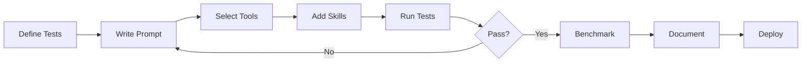

# Quick Reference: Claude Code Agent Development

## 🎯 Golden Rules

1. **One Agent, One Job** - No Swiss Army knives
2. **Name = Function** - `analyze-security` not `helper`
3. **Fail Fast & Clear** - Know your boundaries
4. **Test First, Code Second** - TDAD (Test-Driven Agent Development)
5. **Token Economy** - Every word costs, make them count

## 📋 Agent Checklist

```markdown
□ Single, clear responsibility defined
□ Name follows `action-target` format
□ Maximum 3 primary tools selected
□ Prompt under 500 tokens
□ Input/output contracts specified
□ Error states documented
□ Unit tests written
□ Integration tests passing
□ Fallback behavior defined
□ Performance benchmarked
```

## 🏗️ Agent Template

```yaml
name: action-target
description: "Specific action-oriented description"
model: sonnet  # default, use opus only when necessary

prompt: |
  ## Role
  Single sentence identity
  
  ## Objective  
  Specific measurable goal
  
  ## Process
  1. Step one
  2. Step two
  3. Step three
  
  ## Constraints
  - Boundary 1
  - Boundary 2
  
  ## Output
  Exact format specification

tools:
  primary:
    - essential_tool_1
    - essential_tool_2
  support:
    - optional_tool_1

skills:
  - error_handling
  - validation
  - domain_specific_skill
```

## 🚫 Common Mistakes

| Mistake | Example | Fix |
|---------|---------|-----|
| Vague naming | `helper` | `parse-json` |
| Too many tools | 8 tools | 3 max |
| Verbose prompts | 2000 tokens | <500 tokens |
| No error handling | Silent fails | Explicit errors |
| Missing tests | "It works" | Test suite |
| Feature creep | Multi-purpose | Single purpose |

## 📊 Decision Matrices

### Model Selection
```
Sonnet if:
- Pattern matching task
- Speed critical  
- Well-defined problem
- Token budget tight

OpusPlan if:
- Complex reasoning
- Multi-step planning
- Novel problems
- Quality > Speed
```

### Tool Inclusion
```
Include if:
- Core function requires it
- >80% executions use it
- No alternative exists

Exclude if:
- <20% executions use it
- "Nice to have"
- Adds complexity
- Has working fallback
```

## 🧪 Testing Pyramid

```
        System Tests
       /            \
      Integration    
     /              \
    Skill Unit Tests
   /                \
  Prompt Validation
 ------------------
 Most → Least tests
 Fast → Slow execution
```

## 📈 Performance Targets

```yaml
Latency:
  P50: <500ms
  P95: <2s
  P99: <5s

Success Rate: >95%
Error Rate: <5%
Token Usage: <1000/request
```

## 🔄 Development Flow



## 📝 Naming Conventions

```bash
# Agents
analyze-repository
generate-tests
validate-schema

# Skills  
data_extraction
code_generation
file_manipulation

# Files
prompts/agent_name_system.md
skills/skill_name/index.js
tests/agent_name.test.js
```

## 🎨 Prompt Patterns

### Command Pattern
```
ACTION: analyze
TARGET: repository
OUTPUT: security report
```

### Pipeline Pattern
```
1. Extract → 2. Transform → 3. Load
```

### Conditional Pattern
```
IF condition: use skill_a
ELSE: use skill_b
```

## 🚀 Deployment Readiness

```markdown
Production Checklist:
□ All tests passing
□ Performance benchmarked
□ Error handling complete
□ Documentation updated
□ Version tagged
□ Rollback plan ready
□ Monitoring configured
□ Alerts defined
```

## 💡 Remember

> "The best agent is not the one that can do everything,  
> but the one that does one thing so well that other agents depend on it."

---

**Quick Links:**
- [Core Philosophy](philosophy/CORE_PHILOSOPHY.md)
- [Naming Conventions](philosophy/NAMING_CONVENTIONS.md)
- [Agent Architecture](philosophy/AGENT_ARCHITECTURE.md)
- [Context Engineering](philosophy/CONTEXT_ENGINEERING.md)
- [Skill Composition](philosophy/SKILL_COMPOSITION.md)
- [Testing & Validation](philosophy/TESTING_VALIDATION.md)
- [Tool Selection & MCP](philosophy/TOOL_SELECTION_MCP.md)
